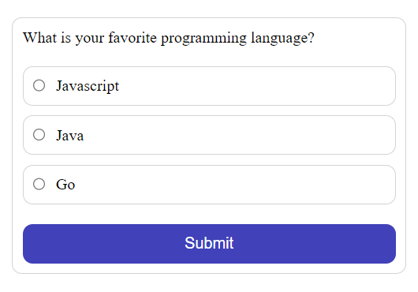
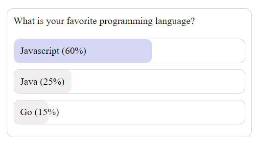

# Poll Widget
The React Poll Widget component allows you to seamlessly integrate interactive polls into your React applications. Engage your users by collecting their opinions with this easy-to-use and customizable poll widget.

## Preview



## Installation
- Pull this branch into your local system.
- Make sure you have Node installed (preferrably Node v18.17.1).
- Navigate to the project directory and run 
  ```
  npm install
  ```
- Once all the dependencies have been installed, run the following command to start the dev server.
  ```
  npm run dev
  ```